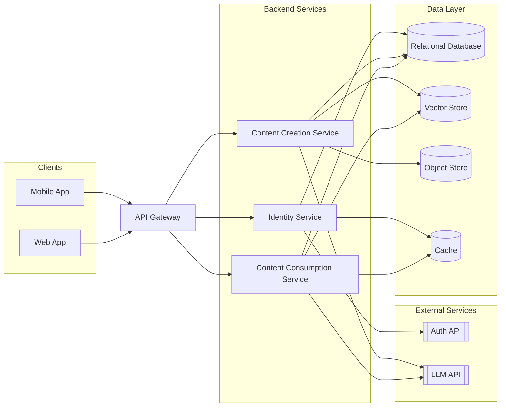

```mermaid
graph LR
    subgraph Clients
        mobile_app["Mobile App"]
        web_app["Web App"]
    end

    api_gateway["API Gateway"]

    subgraph Backend Services
        identity_svc["Identity Service"]
        content_creation_svc["Content Creation Service"]
        content_consumption_svc["Content Consumption Service"]
    end

    subgraph External Services
        auth_api[["Auth API"]]
        llm_api[["LLM API"]]
    end

    subgraph Data Layer
        postgres[("Relational Database")]
        vector_db[("Vector Store")]
        object_store[("Object Store")]
        cache[("Cache")]
    end

    mobile_app --> api_gateway
    web_app --> api_gateway

    api_gateway --> identity_svc
    api_gateway --> content_creation_svc
    api_gateway --> content_consumption_svc

    identity_svc --> auth_api
    identity_svc --> postgres
    identity_svc --> cache

    content_creation_svc --> llm_api
    content_creation_svc --> postgres
    content_creation_svc --> vector_db
    content_creation_svc --> object_store

    content_consumption_svc --> postgres
    content_consumption_svc --> vector_db
    content_consumption_svc --> llm_api
    content_consumption_svc --> cache
```
